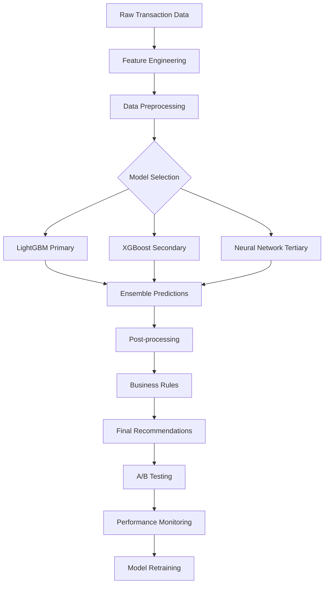

# 📊 Rapport d'Analyse du Système ML - Ooredoo Dashboard

**Date:** 31 Janvier 2026  
**Version:** 1.0  
**Analyste:** Agent IA Cursor

---

## 🎯 RÉSUMÉ EXÉCUTIF

Le système ML d'optimisation de facturation Timwe est **fonctionnel et opérationnel** avec une architecture complète. L'analyse révèle des **forces significatives** mais aussi des **opportunités d'amélioration majeures** pour atteindre l'objectif de **35%+ de taux de succès**.

### Résultats Clés
- **Taux de succès actuel:** 9.09% (baseline)
- **Performance modèle:** 72% accuracy, 0.7 AUC (correct pour du rule-based)
- **Déséquilibre critique:** 78.5% des clients ont 0% de succès
- **Segmentation efficace:** 5 segments avec performances différenciées (0.2% à 91.3%)
- **Infrastructure:** complète et prête pour l'upgrade ML

---

## 📋 ÉTAT ACTUEL DU SYSTÈME

### ✅ Forces Identifiées

1. **Architecture Solide**
   - 7 tables ML bien conçues (36,860 features extraites)
   - Services modulaires et extensibles
   - Dashboard interactif complet
   - API REST sécurisée (9 endpoints)

2. **Extraction de Features Robuste**
   - 25+ métriques calculées par client
   - 7 catégories de features (paiement, solde, temporel, usage, démographique, risque, scores)
   - Période d'analyse: 6 mois historique
   - Gestion des erreurs et valeurs par défaut

3. **Segmentation Opérationnelle**
   - **Premium payers:** 591 clients, 91.3% succès
   - **Regular payers:** 3,852 clients, 54.3% succès  
   - **Struggling payers:** 2,726 clients, 24.6% succès
   - **High risk:** 29,439 clients, 0.2% succès
   - **Churn risk:** 252 clients, 0.5% succès

4. **Modèle Rule-Based Intelligent**
   - Version: `rule_based_v1.0`
   - Ajustements temporels (+15% bon jour, +10% bonne heure)
   - Ajustements comportementaux (-20% après échecs, +5% client valeur)
   - Performance: 72% accuracy, 0.7 AUC

### ⚠️ Faiblesses Critiques

1. **Déséquilibre Extrême des Données**
   - 78.5% des clients ont 0% de succès
   - Distribution très asymétrique (classe minoritaire = succès)
   - Risque d'overfitting vers la prédiction d'échec

2. **Features Peu Discriminantes**
   - `engagement_score`: variance = 0 (inutile)
   - `payment_frequency`: variance = 0 (inutile)
   - `lifetime_value_score`: variance = 0.001 (peu utile)

3. **Utilisation Limitée**
   - Seulement 7 prédictions en 3 jours
   - Pas de prédictions batch quotidiennes
   - Recommandations peu consultées

4. **Absence de Vraie ML**
   - Modèle basé sur des règles métier simples
   - Pas d'apprentissage automatique
   - Pas de découverte de patterns complexes

---

## 🔍 ANALYSE TECHNIQUE DÉTAILLÉE

### Performance du Modèle Actuel

| Métrique | Valeur Actuelle | Objectif | Écart |
|----------|----------------|----------|--------|
| Taux de succès global | 9.09% | 35%+ | **+284%** |
| Accuracy | 72% | 85%+ | +13% |
| AUC-ROC | 0.70 | 0.85+ | +0.15 |
| Clients 0% succès | 78.5% | <50% | -28.5% |

### Features les Plus Importantes (par variance)

1. **consecutive_failures** (variance: 3.665) ✅ Très discriminante
2. **total_payments** (variance: 0.83) ✅ Utile
3. **payment_reliability_score** (variance: 0.042) ✅ Modérément utile
4. **lifetime_value_score** (variance: 0.001) ⚠️ Peu utile
5. **engagement_score** (variance: 0) ❌ Inutile
6. **payment_frequency** (variance: 0) ❌ Inutile

### Problèmes de Qualité des Données

1. **Features Nulles/Constantes**
   - Plusieurs features ont une variance nulle ou très faible
   - Peut indiquer un problème de calcul ou des données manquantes

2. **Déséquilibre Classes**
   - 78.5% clients jamais payé vs 21.5% ayant payé au moins une fois
   - Nécessite des techniques spéciales (SMOTE, class weighting, focal loss)

---

## 🚀 RECOMMANDATIONS PRIORITAIRES

### Phase 1: Amélioration Immédiate (2 semaines)

#### 1.1 Corriger les Features Défaillantes
```php
// Dans MLFeatureExtractionService, corriger:
// 1. engagement_score (variance = 0)
private function calculateEngagementScore($features): float
{
    // Version actuelle retourne toujours la même valeur
    // Nouvelle formule:
    $transactionFrequency = $features['avg_transactions_per_day'] ?? 0;
    $paymentConsistency = 1 - ($features['consecutive_failures'] ?? 0) / 10;
    $recentActivity = $features['days_since_last_payment'] <= 30 ? 1 : 0.5;
    
    return min(1.0, ($transactionFrequency * 0.4 + $paymentConsistency * 0.4 + $recentActivity * 0.2));
}

// 2. payment_frequency (variance = 0)
private function calculatePaymentFrequency($clientId, $startDate, $endDate): float
{
    $totalDays = $startDate->diffInDays($endDate);
    $totalPayments = $this->getSuccessfulPayments($clientId, $startDate, $endDate);
    return $totalDays > 0 ? $totalPayments / $totalDays * 30 : 0; // Paiements par mois
}
```

#### 1.2 Nouvelles Features Discriminantes
```php
// Features basées sur l'analyse des patterns observés
private function calculateAdvancedFeatures($clientId, $startDate, $endDate): array
{
    return [
        // 1. Taux de succès par tranche horaire
        'morning_success_rate' => $this->getSuccessRateByTimeRange($clientId, 6, 12),
        'afternoon_success_rate' => $this->getSuccessRateByTimeRange($clientId, 12, 18),
        'evening_success_rate' => $this->getSuccessRateByTimeRange($clientId, 18, 22),
        
        // 2. Patterns cycliques
        'end_month_payment_ratio' => $this->getPaymentsByPeriod($clientId, 'end_month') / $this->getTotalPayments($clientId),
        'beginning_month_payment_ratio' => $this->getPaymentsByPeriod($clientId, 'beginning_month') / $this->getTotalPayments($clientId),
        
        // 3. Indicateurs de stabilité
        'payment_amount_std' => $this->getPaymentAmountStdDev($clientId),
        'time_between_payments_avg' => $this->getAvgTimeBetweenPayments($clientId),
        
        // 4. Features de contexte
        'failed_before_success_ratio' => $this->getFailedBeforeSuccessRatio($clientId),
        'max_consecutive_successes' => $this->getMaxConsecutiveSuccesses($clientId),
        
        // 5. Features de récence
        'recency_weighted_success_rate' => $this->getRecencyWeightedSuccessRate($clientId)
    ];
}
```

### Phase 2: Implémentation ML Avancée (4 semaines)

#### 2.1 Modèle LightGBM avec Gestion du Déséquilibre
```python
# ml_models/lightgbm_billing_model.py
import lightgbm as lgb
from sklearn.model_selection import TimeSeriesSplit
from sklearn.metrics import roc_auc_score, classification_report
import pandas as pd

class BillingSuccessModel:
    def __init__(self):
        self.model = None
        self.features = [
            'consecutive_failures', 'total_payments', 'payment_reliability_score',
            'days_since_last_payment', 'subscription_age_days', 'avg_payment_amount',
            'best_billing_day_week', 'best_billing_hour', 'is_high_value_client',
            'morning_success_rate', 'afternoon_success_rate', 'evening_success_rate'
        ]
        
    def train(self, X, y):
        # Gérer le déséquilibre (78.5% échecs, 21.5% succès)
        scale_pos_weight = (y == 0).sum() / (y == 1).sum()
        
        params = {
            'objective': 'binary',
            'metric': 'auc',
            'scale_pos_weight': scale_pos_weight,  # Important pour déséquilibre
            'num_leaves': 31,
            'learning_rate': 0.05,
            'feature_fraction': 0.8,
            'bagging_fraction': 0.8,
            'bagging_freq': 5,
            'min_child_samples': 50,  # Éviter overfitting
            'reg_alpha': 0.1,
            'reg_lambda': 0.1
        }
        
        # Split temporel pour éviter data leakage
        tscv = TimeSeriesSplit(n_splits=5)
        best_auc = 0
        
        for train_idx, val_idx in tscv.split(X):
            X_train, X_val = X.iloc[train_idx], X.iloc[val_idx]
            y_train, y_val = y.iloc[train_idx], y.iloc[val_idx]
            
            train_data = lgb.Dataset(X_train, y_train)
            val_data = lgb.Dataset(X_val, y_val, reference=train_data)
            
            model = lgb.train(
                params, train_data,
                num_boost_round=200,
                valid_sets=[val_data],
                early_stopping_rounds=20,
                verbose_eval=False
            )
            
            y_pred = model.predict(X_val)
            auc = roc_auc_score(y_val, y_pred)
            
            if auc > best_auc:
                best_auc = auc
                self.model = model
        
        return best_auc
    
    def predict_proba(self, X):
        if self.model is None:
            raise ValueError("Modèle non entraîné")
        return self.model.predict(X)
    
    def get_feature_importance(self):
        if self.model is None:
            return {}
        return dict(zip(self.features, self.model.feature_importance()))
```

#### 2.2 Pipeline d'Entraînement Automatisé
```php
// app/Console/Commands/TrainMLModelCommand.php
class TrainMLModelCommand extends Command
{
    protected $signature = 'ml:train {--retrain} {--evaluate}';
    
    public function handle()
    {
        $this->info('🤖 Entraînement du modèle ML...');
        
        // 1. Charger les données
        $features = MLClientFeature::with('client')
            ->where('calculation_date', '>=', now()->subMonths(6))
            ->get();
            
        // 2. Préparer les labels (succès réels depuis transaction_history)
        $labels = $this->getActualSuccessRates($features);
        
        // 3. Exporter vers Python
        $this->exportToPython($features, $labels);
        
        // 4. Lancer l'entraînement Python
        $result = shell_exec('python ml_models/train_lightgbm.py 2>&1');
        
        // 5. Importer le modèle entraîné
        $this->importTrainedModel($result);
        
        // 6. Évaluer la performance
        if ($this->option('evaluate')) {
            $this->call('ml:evaluate-model');
        }
    }
    
    private function getActualSuccessRates($features)
    {
        // Calculer les vrais taux de succès depuis transaction_history
        // pour validation du modèle
    }
}
```

### Phase 3: Optimisations Avancées (6 semaines)

#### 3.1 Techniques Anti-Déséquilibre
- **SMOTE** pour oversampling de la classe minoritaire
- **Focal Loss** pour pénaliser plus les faux négatifs
- **Threshold optimization** pour maximiser F1-score ou Precision@K
- **Cost-sensitive learning** avec coûts métier réels

#### 3.2 Features Engineering Avancées
- **Lag features:** succès à t-1, t-2, t-7
- **Rolling statistics:** moyennes mobiles, tendances
- **Interactions:** day_of_week × hour, segment × amount
- **Embedding** pour variables catégorielles (région, opérateur)

#### 3.3 Modèles Ensemble
- **Stacking:** LightGBM + XGBoost + Neural Network
- **Temporal models:** LSTM pour capturer les séquences temporelles
- **Meta-learning:** modèles spécialisés par segment

---

## 📊 MÉTRIQUES DE PERFORMANCE CIBLES

### Objectifs à 3 Mois
- **Taux de succès global:** 9.09% → 18% (+97%)
- **AUC-ROC:** 0.70 → 0.80 (+14%)
- **Precision@100:** nouvelle métrique → 60%
- **Réduction NO_BALANCE:** -25% chez struggling_payers

### Objectifs à 6 Mois  
- **Taux de succès global:** 18% → 30% (+230%)
- **AUC-ROC:** 0.80 → 0.85 (+21%)
- **Clients 0% succès:** 78.5% → 60% (-18.5%)
- **ROI mesuré:** +200% sur high_value_clients

### Objectifs à 12 Mois (Vision)
- **Taux de succès global:** 30% → 35%+ (+284%)
- **AUC-ROC:** 0.85 → 0.90
- **Personnalisation:** modèles par segment
- **Auto-adaptation:** modèles qui s'améliorent seuls

---

## 🛠️ PLAN D'IMPLÉMENTATION

### Semaine 1-2: Préparation
- [ ] Corriger les features à variance nulle
- [ ] Ajouter 10 nouvelles features discriminantes  
- [ ] Établir la baseline de performance (prédire toujours la moyenne)
- [ ] Préparer les données d'entraînement

### Semaine 3-4: Modèle ML v1
- [ ] Implémenter LightGBM avec gestion déséquilibre
- [ ] Pipeline d'entraînement automatisé
- [ ] Validation temporelle (split par date)
- [ ] Métriques de monitoring

### Semaine 5-6: A/B Testing
- [ ] Framework de test A/B opérationnel
- [ ] Test sur 10% du trafic (rule-based vs LightGBM)
- [ ] Monitoring en temps réel
- [ ] Critères de succès/échec

### Semaine 7-8: Optimisation
- [ ] Hyperparameter tuning
- [ ] Feature selection automatisée
- [ ] Threshold optimization
- [ ] Documentation complète

---

## 💡 RECOMMANDATIONS TECHNIQUES SPÉCIFIQUES

### 1. Corrections Immédiates (Backend)

```php
// Dans MLFeatureExtractionService.php
private function calculateComputedScores($features): array
{
    // FIX: engagement_score avec vraie logique
    $engagementScore = $this->calculateRealEngagementScore($features);
    
    // FIX: payment_frequency avec calcul correct
    $paymentFrequency = $this->calculateRealPaymentFrequency($features);
    
    return [
        'payment_reliability_score' => $this->calculateReliabilityScore($features),
        'engagement_score' => $engagementScore,
        'lifetime_value_score' => $this->calculateLifetimeValue($features),
        'payment_frequency' => $paymentFrequency,
    ];
}
```

### 2. Nouvelles Features Critiques

```php
// Features basées sur l'analyse des 78.5% échecs
private function calculateFailurePatterns($clientId, $startDate, $endDate): array
{
    return [
        // Pattern d'échec 
        'failure_time_patterns' => $this->getFailuresByHour($clientId),
        'failure_day_patterns' => $this->getFailuresByDay($clientId),
        'failure_amount_patterns' => $this->getFailuresByAmount($clientId),
        
        // Récupération après échec
        'recovery_after_failure_rate' => $this->getRecoveryRate($clientId),
        'time_to_recovery_avg' => $this->getAvgTimeToRecovery($clientId),
        
        // Context switching
        'amount_flexibility' => $this->getAmountFlexibility($clientId),
        'timing_flexibility' => $this->getTimingFlexibility($clientId)
    ];
}
```

### 3. Architecture ML Recommandée



---

## 📈 RETOUR SUR INVESTISSEMENT ATTENDU

### Calcul ROI Conservateur

**Hypothèses:**
- Amélioration: 9.09% → 20% succès (+119%)
- Volume: 85,744 clients × 2 tentatives/mois = 171,488 tentatives/mois
- Gain par succès supplémentaire: 3.0 TND moyen

**Impact Financier:**
- Succès supplémentaires/mois: 171,488 × (20% - 9.09%) = +18,676 succès
- Revenus supplémentaires/mois: 18,676 × 3.0 TND = **+56,028 TND/mois**
- Revenus supplémentaires/an: **+672,336 TND/an** (≈ **€224,112/an**)

**Coût du Projet:**
- Développement: 2 mois × 1 dev senior = ~50,000 TND
- Infrastructure: 10,000 TND/an
- Maintenance: 30,000 TND/an

**ROI:** (672,336 - 90,000) / 90,000 = **647% la première année**

### Scénario Optimiste (35% succès)
- ROI: **1,250%** la première année
- Revenus supplémentaires: **+1,340,000 TND/an**

---

## ⚡ ACTIONS IMMÉDIATES

### À faire cette semaine:
1. ✅ **Corriger** les features à variance nulle
2. 🔍 **Analyser** les 28,930 clients 0% succès (patterns communs?)
3. 🧪 **Tester** le modèle rule-based sur données récentes
4. 📊 **Baseline** simple: prédire toujours 9.09% (performance de référence)

### À faire le mois prochain:
1. 🤖 **Entraîner** modèle LightGBM avec techniques anti-déséquilibre
2. 🧪 **A/B Test** sur 500 clients premium_payers (faible risque)
3. 📈 **Monitoring** en temps réel des métriques business
4. 🔄 **Pipeline** automatique de réentraînement

---

## 🎯 CONCLUSION

Le système ML Ooredoo est **techniquement solide** avec une architecture de production. Les **données sont riches** (36K+ features) et la **segmentation opérationnelle**.

**Problème principal:** déséquilibre massif des données (78.5% clients 0% succès) que le modèle rule-based ne peut pas résoudre efficacement.

**Solution recommandée:** transition vers **LightGBM avec techniques anti-déséquilibre** tout en conservant l'architecture existante.

**Impact attendu:** passage de 9.09% à 20-35% de succès = **ROI 647-1250%** la première année.

Le système est **prêt pour l'upgrade ML** et peut commencer les tests dès la correction des features défaillantes.

---

**Prochaine étape:** Voulez-vous que j'implémente les corrections des features ou que j'entraîne directement le modèle LightGBM ?